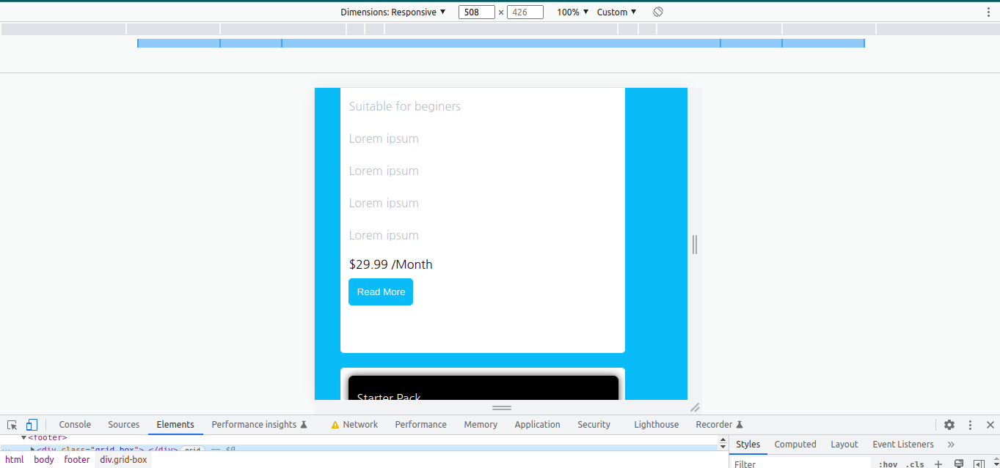
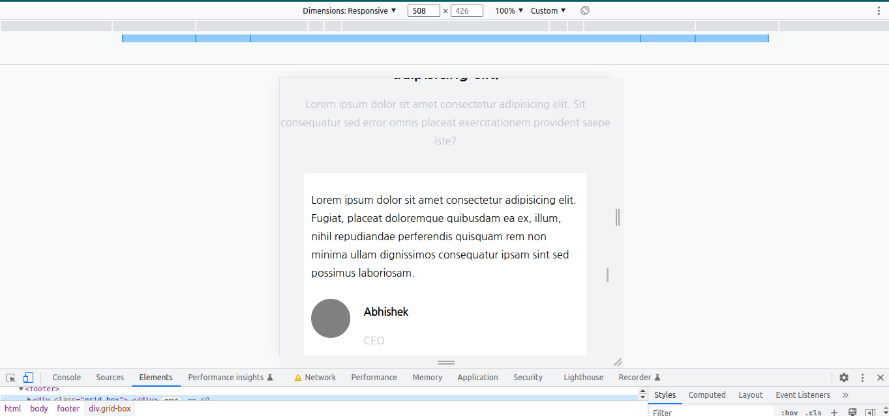

# I am Abhishek Singh
_I am learning Full stack javascript Development_

## This is the assignment that is the part of our live course.
### In this project  I used flex property and to make a card  i used grid also .
### This is responsive for all screen size

### On the small screen size i used flex-direction : column 


# Project 12
1. Hoisting Landing page 

# Technology used:
1. ```HTML5```
1. ```CSS3```

# Deployed Link
[Netlify Link](https://hoisting-landing-page.netlify.app/)






# Time Taken To Complete This project

_9hours_ 